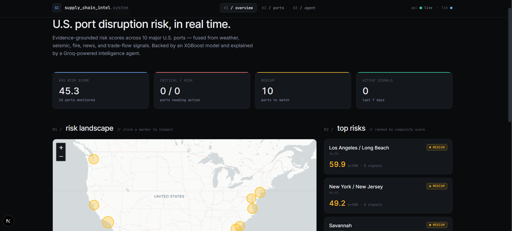
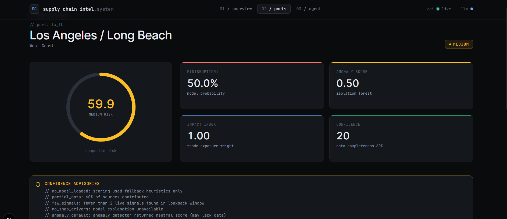
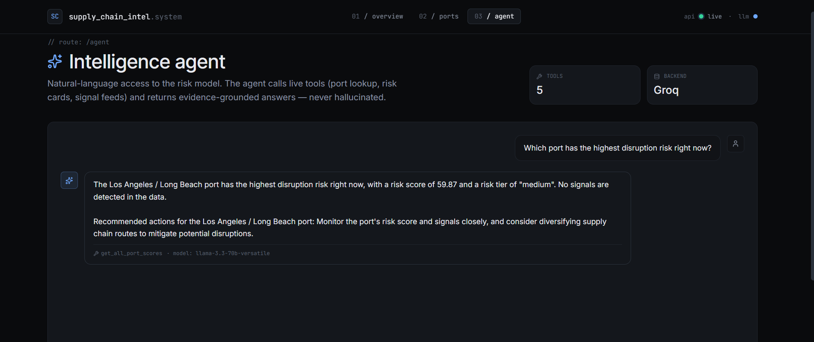

# Supply Chain Intelligence System

> Real-time port disruption risk for U.S. supply chains — fused from weather,
> seismic, fire, news, and trade-flow signals; explained by a calibrated XGBoost
> model and narrated by an LLM agent grounded in live evidence.

<p align="center">
  <a href="https://github.com/jenildabhi/supply-chain-intelligence-system/actions/workflows/ci.yml"></a>
  
  
  
  
  
</p>

> Note: the CI badge above resolves once you push to GitHub. Replace
> `jenildabhi` with your GitHub username if different.

---

## What this is

Most "supply chain ML" demos stop at a notebook with a confusion matrix. This one
goes end-to-end: live ingestion from five free public APIs, a medallion data lake,
a calibrated XGBoost classifier with SHAP explainability, anomaly detection, a
weighted risk score, a what-if simulator, and an LLM agent that calls real tools
(not a chatbot wrapper) to answer questions grounded in current evidence.

The whole stack is **free to run** — no paid APIs, no managed databases, no
SaaS dependencies.

## Live demo

|              | Link                                       | Stack                          |
| ------------ | ------------------------------------------ | ------------------------------ |
| **Frontend** | https://supply-chain-intel.vercel.app *(deploy in progress)* | Next.js 16 on Vercel           |
| **API docs** | https://hf.co/spaces/jenildabhi/sci-api *(deploy in progress)* | FastAPI on HuggingFace Spaces  |

> See [`deploy/README.md`](deploy/README.md) for the full deployment guide
> (Vercel + HuggingFace Spaces, both free tier).

## Screenshots

<p align="center">
  
  <br/><em>Overview: composite risk landscape across 10 monitored U.S. ports.</em>
</p>

<p align="center">
  
  <br/><em>Port detail: animated gauge, SHAP drivers, live signals, what-if simulator, recommended actions.</em>
</p>

<p align="center">
  
  <br/><em>Intelligence agent: LLM grounded in live tool calls, with attribution.</em>
</p>

## Architecture

```
┌─────────────────────────────────────────────────────────────────────────┐
│                          INGESTION (Bronze)                              │
│   NWS · GDELT · USGS · NASA FIRMS · BTS                                  │
│   APScheduler → src/ingestion/*.py                                       │
└──────────────────────────────┬──────────────────────────────────────────┘
                               │
┌──────────────────────────────▼──────────────────────────────────────────┐
│                FEATURES (Silver → Gold)                                  │
│   src/features/pipeline.py → port_week_features.parquet (48 cols)        │
└──────────────────────────────┬──────────────────────────────────────────┘
                               │
┌──────────────────────────────▼──────────────────────────────────────────┐
│                            ML LAYER                                       │
│   XGBoost (Optuna-tuned) · IsolationForest · Isotonic calibration        │
│   Walk-forward CV · PR-AUC eval · SHAP explanations                      │
│   Champion/challenger registry → models/manifest.json                    │
└──────────────────────────────┬──────────────────────────────────────────┘
                               │
┌──────────────────────────────▼──────────────────────────────────────────┐
│                       RISK SCORING ENGINE                                │
│   src/scoring/scorer.py → RiskCard (0–100 score, tier, confidence,      │
│   active signals, SHAP drivers, recommended actions)                     │
└──────────────────────────────┬──────────────────────────────────────────┘
                               │
                ┌──────────────┴──────────────┐
                │                              │
┌───────────────▼────────────┐    ┌────────────▼──────────────────────┐
│   FastAPI                   │    │   LLM Agent (Groq)                 │
│   /risk · /ports · /alerts  │    │   5 tools, evidence-grounded       │
│   /explain · /simulate      │    │   Falls back to scorer if rate-lim │
└───────────────┬─────────────┘    └────────────┬───────────────────────┘
                │                                │
                └──────────────┬─────────────────┘
                               │
┌──────────────────────────────▼──────────────────────────────────────────┐
│                       Next.js 16 Frontend                                │
│   Overview map · Risk table · Port detail · Simulator · Agent chat       │
└─────────────────────────────────────────────────────────────────────────┘
```

## How risk is computed

A composite weighted score, sigmoid-squashed to `[0, 100]`:

```
risk_score = 100 · sigmoid( 0.5·(p−0.5)·4
                          + 0.3·(a−0.5)·4
                          + 0.2·(i−0.5)·4 )
```

| Component         | Weight | Source                                                |
| ----------------- | ------ | ----------------------------------------------------- |
| `p_disruption`    | 0.50   | XGBoost predicted probability, isotonic-calibrated    |
| `anomaly_score`   | 0.30   | IsolationForest on weekly feature vector              |
| `impact_index`    | 0.20   | Port trade exposure (TEU-based, normalized)           |

Tiers map: `< 30` low · `30–60` medium · `60–80` high · `≥ 80` critical.

A separate **confidence score** deducts from 100 based on data completeness,
signal availability, and presence of SHAP drivers — surfaced as flags
(e.g. `// no_recent_bts_data`, `// fewer_than_2_signals`) on the port card so
users see *why* confidence is low, not just that it is.

### Disruption label (training target)

`berthing_time > rolling 52-week 75th percentile` — **per port**, not global.
LA/LB normal berthing time is structurally higher than Baltimore; a global
threshold would incorrectly flag every LA week as "disruption."

### Why PR-AUC over ROC-AUC

Disruption weeks are the minority class (~10–15%). ROC-AUC is misleadingly
optimistic on imbalanced data; PR-AUC tracks precision at the operating point
that matters. CV PR-AUC on the trained champion: **0.993**.

### Why walk-forward CV, not k-fold

Time leakage. A random split lets the model "see" 2022 weeks while predicting
2021 — invalid for a forecasting task. Walk-forward respects temporal order
across all ports simultaneously.

## How the agent works

The agent is **not** an LLM summarizing a static prompt. It's a tool-calling
loop (Groq's tool API, Llama 3.3 70B) where every fact comes from a live
function call:

| Tool                    | What it does                                               |
| ----------------------- | ---------------------------------------------------------- |
| `list_ports`            | Returns the 10 monitored U.S. ports with metadata         |
| `get_risk_card`         | Full risk card for a port (score, drivers, signals)        |
| `get_all_port_scores`   | Compact summaries across all ports                         |
| `get_active_signals`    | Live weather/seismic/fire/news signals for a port          |
| `get_top_risk_ports`    | Top-N ranked by composite score                            |

If Groq returns 429 (free-tier rate limit), the agent degrades to a structured
scorer summary and tells the user. If Groq returns 400 (`tool_use_failed` —
LLM produced bad JSON), it retries once without tool schemas. No silent
failures.

## Tech stack

| Layer            | Choice                                | Why                                                    |
| ---------------- | ------------------------------------- | ------------------------------------------------------ |
| Ingestion        | httpx + tenacity + APScheduler        | Async-friendly, retry/backoff, no background daemon    |
| Storage          | DuckDB + Parquet (medallion)          | Free, columnar, no server, embedded analytics          |
| ML               | XGBoost + IsolationForest + SHAP      | Industry standard for tabular, explainable             |
| Tuning           | Optuna (TPE)                          | Smarter than grid search, free                         |
| Tracking         | MLflow (local)                        | Run history without a managed backend                  |
| Calibration      | Isotonic regression (sklearn)         | Probabilities you can multiply with weights            |
| API              | FastAPI                               | Pydantic validation, OpenAPI docs for free             |
| LLM              | Groq · Llama 3.3 70B                  | Free tier, fast inference (~300ms TTFT)                |
| Frontend         | Next.js 16 · TypeScript · Tailwind v4 | Server components, modern React, clean dark UI         |
| Charts / Map     | Recharts · react-leaflet              | Free, open source, MIT                                 |
| Animation        | Framer Motion                         | One animation: the gauge arc fill                      |

## Quickstart

### Prerequisites
- Python **3.11+**
- Node.js **20+**
- Free API keys (optional but recommended for full functionality):
  - [NASA FIRMS](https://firms.modaps.eosdis.nasa.gov/api/) for fire detection
  - [Groq](https://console.groq.com) for the LLM agent

### Local dev

```bash
# 1. Backend setup
git clone https://github.com/<you>/supply-chain-intelligence-system
cd supply-chain-intelligence-system

cp .env.example .env                     # then fill in your free API keys
pip install -r requirements.txt

# 2. Ingest data + train initial model (one-shot, ~2–3 min)
python bootstrap.py

# 3. Start the API (terminal 1)
uvicorn src.api.main:app --reload        # http://localhost:8000

# 4. Start the frontend (terminal 2)
cd frontend
cp .env.local.example .env.local
npm install
npm run dev                              # http://localhost:3000

# 5. Optional: continuous data refresh (terminal 3)
python scheduler.py
```

### Docker (one command)

```bash
docker compose up --build
# Frontend: http://localhost:3000
# API:      http://localhost:8000
# API docs: http://localhost:8000/docs
```

### Tests

```bash
pytest tests/                            # 279 tests · ~85s
cd frontend && npm run lint && npm run build
```

## Project structure

```
.
├── bootstrap.py                # one-shot setup: ingest → features → train
├── config.py                   # central config: ports, settings
├── scheduler.py                # APScheduler ingestion loops
├── requirements.txt
├── Dockerfile                  # API container (multi-stage)
├── docker-compose.yml          # full stack: scheduler + api + frontend
│
├── src/
│   ├── ingestion/              # NWS, GDELT, USGS, NASA FIRMS, BTS clients
│   ├── storage/                # DataLake (Bronze/Silver/Gold) + DuckDB metadata
│   ├── features/               # Feature builders → port-week features
│   ├── models/                 # Trainer, anomaly, calibrator, explainer, registry
│   ├── scoring/                # RiskScorer, signal assembler, RiskCard
│   ├── agent/                  # Groq tool-calling agent + 5 tools
│   └── api/                    # FastAPI app
│
├── frontend/
│   ├── app/                    # Next.js App Router pages
│   ├── components/             # TopNav, RiskGauge, SHAPChart, Chat, ...
│   ├── lib/api.ts              # Typed FastAPI client
│   └── Dockerfile              # Standalone Next.js runtime
│
├── tests/                      # 279 pytest unit + integration tests
├── data/                       # Local data lake (gitignored)
├── models/                     # Trained model artifacts (gitignored)
└── docs/screenshots/           # README screenshots
```

## Roadmap

- [ ] **Phase 7 — Production hardening:** model drift detection, alert webhooks
- [ ] Forecast horizon expansion (currently 7 days; target 14/30)
- [ ] Multi-modal signals: AIS vessel positions, satellite imagery
- [ ] User accounts + saved dashboards (currently single-tenant)

## Acknowledgements

Free public data: NOAA NWS · USGS · NASA FIRMS · GDELT Project · U.S. Bureau
of Transportation Statistics. Free LLM inference: Groq.

## License

MIT — see [LICENSE](LICENSE).

## Author

**Jenil Dabhi** · [portfolio](https://jenildabhi.vercel.app/) · jenildabhi10@gmail.com
